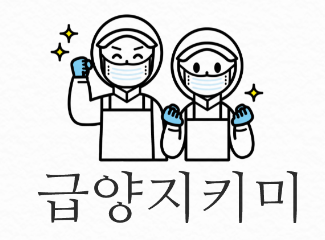
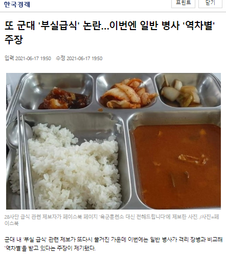
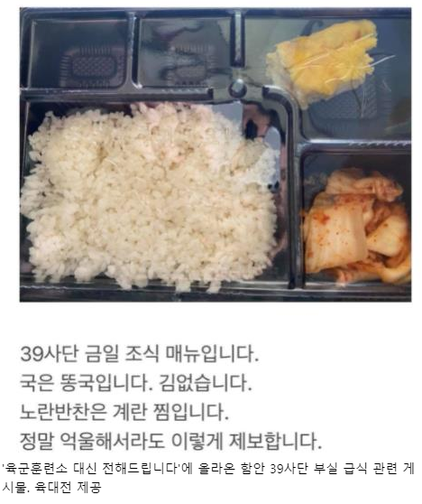
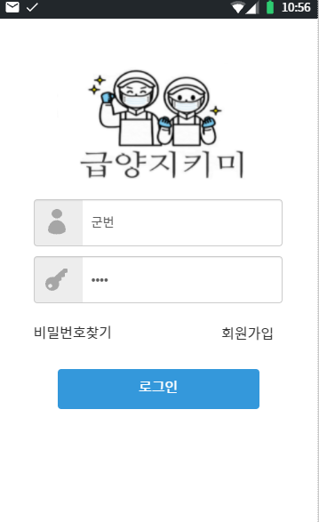
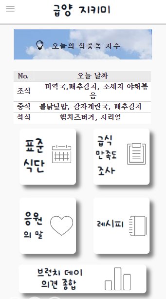
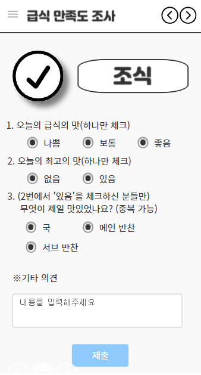

# 🔴팀 명🤸🏻‍♀️
### 🍚RT (Rice_Thieves) 밥도둑

# 🟠프로젝트명🗂
### 🍱급양지키미(Geubyang_Jikimi)

## 🟡프로젝트 개발 동기🙏
|||
|:---:|:---:|

현재 국군 장병들은, 코로나 19로 인해 외출, 외박, 휴가가 자유롭지 못하고, 배달음식마저 식중독 등의 이유로 통제되어있습니다. 이로 인해, 장병들의 식습관은 오직 급식과 PX에만 의존할 수밖에 없는 상황이 되었습니다. 이에 더해 최근 ‘육군훈련소 대신 전해드립니다’를 통해 장병들의 가족들도 군대의 급식에 관심을 가지기 시작했습니다. 안타깝게도 커진 관심에 취사병들의 부담 또한 나날이 커지고 있습니다. 취사병들의 취사 외적인 영역에 대한 스트레스를 줄여주고, 더 체계적인 급양 관리가 이루어지도록 (급양 지키미) 앱을 계획하게 되었습니다. 

(사진 출처 : 한국경제, 육대전)

## 🟢프로젝트 소개📜
 이 앱의 기능은 다음과 같습니다. 
1. 로그인 후 메인화면을 통해 오늘의 표준식단을 알려줍니다.
2. 메뉴창으로 들어가면 ‘오늘의 식중독 지수’, ‘청결, 위생 강조’ 를 알려줍니다. 
3. 장병들 모두가 이용할 수 있는 게시판을 만들어, 끼니별로 만족도를 조사할 수 있는 공간을 만듭니다.
4. 국군 전 부대의 취사병들과 조리부사관들이 이용할 수 있는 게시판을 만들어, 레시피를 공유할 수 있는 공간을 만듭니다.
5. 부식 수령 및 창고 정리의 편리성을 위해 부식의 정보를 앱에 입력하여, 관리할 수 있도록 합니다. 추가로, QR코드를 인식할 수 있는 기술을 사용하면 더 편리할 것이라고 판단하고 있습니다.
6. 아침 일찍 일어나 고생하는 취사병을 위해 응원의 한마디를 적을 수 있는 공간을 마련합니다.

## 🔵기능 설명📖
<table>
        <tbody>
		<tr>
			<td colspan=2>
				 
				<b>ㆍ 📱 로그인 화면</b> 
				 
			</td>
		</tr>
		<tr>
            <td rowspan="2">

</td>
            <td width="33%">< 앱 실행후 첫 화면 ></td>
        </tr>
        <tr>
            <td> - 로그인 및 회원가입을 할 수 있는 곳</td>
        </tr>
		  </tbody>
</table>
        
<table>
        <tbody>
		<tr>
			<td colspan=2>
				 
				<b>ㆍ 💡 메인화면 기능</b> 
				 
			</td>
		</tr>
		<tr>
            <td rowspan="2">

</td>
            <td width="33%">< 앱의 메인화면 ></td>
	</tr>
	<tr>
		<td> - 달력 및 응원의 말, 레시피 게시판 아이콘</td>
        </tr>
	<tr>
           <td rowspan="2">

</td>
           <td> < 표준식단표 ></td>
         </tr>
        <tr>
            <td> - 매일 조식, 중식, 석식을 확인 가능</td>
        </tr>
		  </tbody>
</table>
  
		
<table>
        <tbody>
		<tr>
			<td colspan=2>
				 
				<b>ㆍ ✏ 급식 만족도 조사</b> 
				 
			</td>
		</tr>
		<tr>
            <td rowspan="2">

</td>
            <td width="33%">< 급식 만족도 조사 ></td>
	 </tr>
        <tr>
            <td> - 매 끼니마다 급식 만족도 조사하여 급식의 질을 향상식중독 지수 확인 및 손씻기 강조, 로그아웃, 창고정리</td>
        </tr>
		  </tbody>
      
</table>
		
<table>
        <tbody>
		<tr>
			<td colspan=2>
				 
				<b>ㆍ 👊 응원게시판</b> 
				 
			</td>
		</tr>
		<tr>
            <td rowspan="2">

</td>
            <td width="33%"><고생하는 취사병들에게 따뜻한 말 한마디 건네는 게시판></td>
        </tr>
        <tr>
            <td> - 응원의 공간을 만들어 취사병들의 마음을 다독여 줄 수 있으며, 마음의 짐을 덜어주는 효과</td>
        </tr>
		  </tbody>
</table>
		
<table>
        <tbody>
		<tr>
			<td colspan=2>
				 
				<b>ㆍ 📃 레시피공유</b> 
				 
			</td>
		</tr>
		<tr>
            <td rowspan="2">

</td>
            <td width="33%"><국군 전 부대 취사병과 조리부사관의 ‘소통의 장’></td>
        </tr>
        <tr>
            <td> - 타 부대와 레시피를 공유가능</td>
        </tr>
		  </tbody>
</table>
		
<table>
        <tbody>
		<tr>
			<td colspan=2>
				 
				<b>ㆍ 📦 취사병들의 창고</b> 
				 
			</td>
		</tr>
		<tr>
            <td rowspan="2">

</td>
            <td width="33%">< 간편한 창고 정리 ></td>
	</tr>
	<tr>
		<td> - 부식수령 후 손쉽게 창고 물품들을 작성 가능</td>
	</tr>
	<tr>
           <td rowspan="2">

</td>
           <td> - 창고 정리완료</td>
        </tr>
   </tbody>
	
</table>
  
<table>
        <tbody>
		<tr>
			<td colspan=2>
				 
				<b>ㆍ 🔔 메뉴창</b> 
				 
			</td>
		</tr>
		<tr>
            <td rowspan="2">

</td>
            <td width="33%"> < 부가적인 요소 확인 가능한 곳 ></td>
       </tr>
        <tr>
            <td> - 식중독 지수 확인 및 손씻기 강조, 로그아웃, 창고정리</td>
        </tr>
		  </tbody>
</table>
        

## 🟣사용 기술
### 1. 카카오 오븐(oven)을 이용한 앱 스캐치
|||| 
 |:---:|:---:|:---:|

👇아래 링크를 통하여 보실 수 있습니다!!
 
 https://ovenapp.io/view/yUsnKJS2pT7j0miAHl7SmEzuznLKJp7F/
### 2. Flutter
 

## ⚫추가 전망
 **QR코드** 기능을 추가하여 수기로 작성하지 않고 부식에 있는 QR코드를 찍어 바로 창고정리가 가능하게 할 수 있습니다.
## 🟤설치 안내
📱 **안드로이드폰**은 '**Google play**'에서!!

📱 **애플**은 '**App Store**'에서 만나보실 수 있습니다!!

## 🙏팀 정보 (Team Information)
|이름|이메일|Github Id|
|:---:|:---:|:---:|
|김동현|ehdgus1776@gmail.com|Github Id: ehdgus1776|
|이강선|lks191225@gmail.com|Github Id: lks191225|
|모지훈|morivy42@gmail.com|Github Id: morivy42|

## ‼저작권 및 사용권 정보 (Copyleft / End User License)
 * [MIT](https://github.com/osam2020-WEB/Sample-ProjectName-TeamName/blob/master/license.md)

This project is licensed under the terms of the MIT license.

※ [라이선스 비교표(클릭)](https://olis.or.kr/license/compareGuide.do)

※ [Github 내 라이선스 키워드(클릭)](https://docs.github.com/en/github/creating-cloning-and-archiving-repositories/creating-a-repository-on-github/licensing-a-repository)

※ [\[참조\] Github license의 종류와 나에게 맞는 라이선스 선택하기(클릭)](https://flyingsquirrel.medium.com/github-license%EC%9D%98-%EC%A2%85%EB%A5%98%EC%99%80-%EB%82%98%EC%97%90%EA%B2%8C-%EB%A7%9E%EB%8A%94-%EB%9D%BC%EC%9D%B4%EC%84%A0%EC%8A%A4-%EC%84%A0%ED%83%9D%ED%95%98%EA%B8%B0-ae29925e8ff4)
