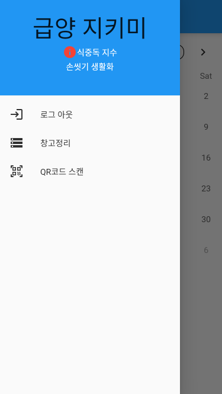

# 🔴팀 명🤸🏻‍♀️
### 🍚RT (Rice_Thieves) 밥도둑

# 🟠프로젝트명🗂
### 🍱급양지키미(Geubyang_Jikimi)

## 🟡프로젝트 개발 동기🙏
|||
|:---:|:---:|

현재 국군 장병들은, 코로나 19로 인해 외출, 외박, 휴가가 자유롭지 못하고, 배달음식마저 식중독 등의 이유로 통제되어있습니다. 이로 인해, 장병들의 식습관은 오직 급식과 PX에만 의존할 수밖에 없는 상황이 되었습니다. 이에 더해 최근 ‘육군훈련소 대신 전해드립니다’를 통해 장병들의 가족들도 군대의 급식에 관심을 가지기 시작했습니다. 안타깝게도 커진 관심에 취사병들의 부담 또한 나날이 커지고 있습니다. 취사병들의 취사 외적인 영역에 대한 스트레스를 줄여주고, 더 체계적인 급양 관리가 이루어지도록 (급양 지키미) 앱을 계획하게 되었습니다. 

(사진 출처 : 한국경제, 육대전)

## 🟢프로젝트 소개📜
 이 앱의 기능은 다음과 같습니다. 
1. 앱을 실행하고 메뉴창으로 들어가면 ‘오늘의 식중독 지수’, ‘청결, 위생 강조’ 를 알려줍니다. 
2. 장병들 모두가 이용할 수 있는 게시판을 만들어, 끼니별로 만족도를 조사할 수 있는 공간을 만듭니다.
3. 국군 전 부대의 취사병들과 조리부사관들이 이용할 수 있는 게시판을 만들어, 레시피를 공유할 수 있는 공간을 만듭니다.
4. 부식 수령 및 창고 정리의 편리성을 위해 부식의 정보를 앱에 입력하여, 관리할 수 있도록 합니다. 추가로, QR코드를 인식할 수 있는 기술을 사용하면 더 편리할 것이라고 판단하고 있습니다.
5. 아침 일찍 일어나 고생하는 취사병을 위해 응원의 한마디를 적을 수 있는 공간을 마련합니다.

## 🔵기능 설명📖
<table>
        <tbody>
		<tr>
			<td colspan=2>
				 
				<b>ㆍ 로그인 화면</b> 
				 
			</td>
		</tr>
		<tr>
            <td rowspan="2">

</td>
            <td width="33%">로그인 및 회원가입앗쌀라마이쿰 싸와디캅 </td>
        </tr>
        
<table>
        <tbody>
		<tr>
			<td colspan=2>
				 
				<b>ㆍ 메인화면 기능</b> 
				 
			</td>
		</tr>
		<tr>
            <td rowspan="2">

</td>
            <td width="50%">로그인 및 회원가입</td>
	</tr>
	<tr>
        </tr>
	<tr>
           <td rowspan="2">

</td>
           <td>표준식단표</td>
        </tr>
   </tbody>
</table>
  
		
<table>
        <tbody>
		<tr>
			<td colspan=2>
				 
				<b>ㆍ 급식만족도조사</b> 
				 
			</td>
		</tr>
		<tr>
            <td rowspan="2">

</td>
            <td width="33%">급식만족도조사</td>
        </tr>
		
<table>
        <tbody>
		<tr>
			<td colspan=2>
				 
				<b>ㆍ 응원게시판</b> 
				 
			</td>
		</tr>
		<tr>
            <td rowspan="2">

</td>
            <td width="33%">고생하는 취사병들에게 따뜻한 말 한마디 건네는 게시판</td>
        </tr>
		
<table>
        <tbody>
		<tr>
			<td colspan=2>
				 
				<b>ㆍ 레시피공유</b> 
				 
			</td>
		</tr>
		<tr>
            <td rowspan="2">

</td>
            <td width="33%">국군 전 부대 취사병과 조리부사관의 ‘소통의 장’, 타 부대와 레시피를 공유가 가능</td>
        </tr>
		
<table>
        <tbody>
		<tr>
			<td colspan=2>
				 
				<b>ㆍ 취사병들의 창고</b> 
				 
			</td>
		</tr>
		<tr>
            <td rowspan="2">

</td>
            <td width="33%">창고에 들어갈 물품 추가</td>
	</tr>
	<tr>
        </tr>
	<tr>
           <td rowspan="2">

</td>
           <td>창고정리완료</td>
        </tr>
   </tbody>
	
</table>
  

<table>
        <tbody>
		<tr>
			<td colspan=2>
				 
				<b>ㆍ 메뉴창</b> 
				 
			</td>
		</tr>
		<tr>
            <td rowspan="2">

</td>
            <td width="33%">식중독 지수 확인 및 손씻기 강조, 로그아웃, 창고정리</td>
        </tr>
        
| |앱 실행 후 메뉴창과 메인 화면을 통해, 장병들의 청결도를 높일 수 있습니다. 식중독과 같은 질병은, 사실 경각심이 잘 들지 않기 때문에, 앱을 통해 반복적인 경고를 하면 예방이 원활하게 될 것으로 예상합니다. 또한, 매일의 표준식단을 반강제적으로 보게 하여 장병들의 식단에 대한 이해도를 높일 수 있고, 특히 취사병들이 다음 끼니를 머릿속으로 구상하게 할 수 있습니다.|
|:---:|:---:|
| |매 끼니 급식 만족도 조사를 하는 기능은 취사병들의 일과의 성취도를 시각적으로 보여줍니다. 그렇기 때문에, 서로 피드백도 더욱 더 편하게 할 수 있을 것이라고 판단합니다. 그리고, 장병들도 식사 직후 평가를 하기에, 시간이 흐른 후 평가를 하는 것에 비해 더 섬세하고 확실한 평가가 가능하게 됩니다.|
| |국군 전 부대 취사병과 조리부사관의 ‘소통의 장’을 만드는 것은, 앞서 받았던 끼니별 식단의 피드백을 좀 더 효과적으로 할 수 있게 합니다. 아무래도, 취사병 중에는 경력자가 많이 없기 때문에, 취사에 대한 이해도가 부족한 것을 고려하면, 타 부대와 레시피를 공유하며 취사를 하는 것이 부대 내 취사병들끼리만 고민하는 것보다 더 효율적일 것입니다.|
| |부식을 수령하고, 그것들을 관리하는 것은 많은 신경이 쓰일 수밖에 없습니다. 이 앱의 제작 목적인 ‘취사병들의 취사 외적인 영역에 대한 스트레스를 줄여주기’는 이 기능으로 크게 해결될 수 있을 것이라고 판단합니다. 이 앱을 이용하면, 유통기한이 다가오는 제품들을 자동으로 알려주기 때문에, 유통기한을 잘못 판단하여 버리게 되는 현상이 확연히 줄어들 수 있습니다. 또한, 남은 부식의 양과 필요한 부식의 존재 여부를 빠르고 정확하게 판단할 수 있어, 재료가 부족한 상황에 유연하게 대처할 수 있습니다. 추가로, QR코드를 이용하게 되면, 일일이 작성해야 하는 소요를 줄여줄 수 있습니다.|
| |취사병을 위한 응원의 공간을 만들어 취사병들의 마음을 다독여 줄 수 있습니다. 사실, 취사 자체도 쉽지 않은 일이지만, 취사 이후, 음식의 맛을 평가하는 수많은 장병과 간부들의 말 한마디가 많은 스트레스가 된다고 알고 있습니다. 우리가 취사 자체를 직접적으로 도울 수는 없으나, 따뜻한 말 한마디들이 취사병들에게 보람이 되어 마음의 짐을 덜어줄 수 있을 거라고 기대합니다.|
| |최근, 브런치데이가 원활하게 시행되고 있습니다. 브런치데이를 하는 날이 많지 않기 때문에, 장병들은 평소와 조금이라도 차별화된 식단을 원하고 있습니다. 브런치데이의 메뉴, 시행날짜, 추가로 구매했으면 하는 음료 등을 매달 조사하고 취사병들과 조율하면, 장병들과 취사병 모두에게 브런치데이의 취지인 즐길 수 있는 날이 될 것으로 생각합니다. 종합적으로, 이 앱은 4차산업혁명에 걸맞은 스마트한 방법으로 취사병들과 취사병이 아닌 장병들 사이의 경계를 허무는 것을 바라보고 있습니다. 기존 취사병들에게 모두 부여되었던 부담들과 맛에 대한 수많은 평가를 시각적으로 보여주고, 가까운 거리에서 소통함으로써, 궁극적으로 국군 전체의 급식을 장병 모두가 함께 개선해 나가는 것을 기대하고 있습니다.|

## 🟣사용 기술
### 1. 카카오 오븐(oven)을 이용한 앱 스캐치
|||| 
 |:---:|:---:|:---:|

👇아래 링크를 통하여 보실 수 있습니다!!
 
 https://ovenapp.io/view/yUsnKJS2pT7j0miAHl7SmEzuznLKJp7F/
### 2. Flutter
 

## 🟤설치 안내
📱 **안드로이드폰**은 '**Google play**'에서!!

📱 **애플**은 '**App Store**'에서 만나보실 수 있습니다!!

## ⚫앱 사용법
**마크다운 문법을 이용하여 자유롭게 기재**

잘 모를 경우
구글 검색 - 마크다운 문법
[https://post.naver.com/viewer/postView.nhn?volumeNo=24627214&memberNo=42458017](https://post.naver.com/viewer/postView.nhn?volumeNo=24627214&memberNo=42458017)

 편한 마크다운 에디터를 찾아서 사용
 샘플 에디터 [https://stackedit.io/app#](https://stackedit.io/app#)
 
## 🙏팀 정보 (Team Information)
|이름|이메일|Github Id|
|:---:|:---:|:---:|
|김동현|ehdgus1776@gmail.com|Github Id: ehdgus1776|
|이강선|lks191225@gmail.com|Github Id: lks191225|
|모지훈|morivy42@gmail.com|Github Id: morivy42|

## ‼저작권 및 사용권 정보 (Copyleft / End User License)
 * [MIT](https://github.com/osam2020-WEB/Sample-ProjectName-TeamName/blob/master/license.md)

This project is licensed under the terms of the MIT license.

※ [라이선스 비교표(클릭)](https://olis.or.kr/license/compareGuide.do)

※ [Github 내 라이선스 키워드(클릭)](https://docs.github.com/en/github/creating-cloning-and-archiving-repositories/creating-a-repository-on-github/licensing-a-repository)

※ [\[참조\] Github license의 종류와 나에게 맞는 라이선스 선택하기(클릭)](https://flyingsquirrel.medium.com/github-license%EC%9D%98-%EC%A2%85%EB%A5%98%EC%99%80-%EB%82%98%EC%97%90%EA%B2%8C-%EB%A7%9E%EB%8A%94-%EB%9D%BC%EC%9D%B4%EC%84%A0%EC%8A%A4-%EC%84%A0%ED%83%9D%ED%95%98%EA%B8%B0-ae29925e8ff4)
